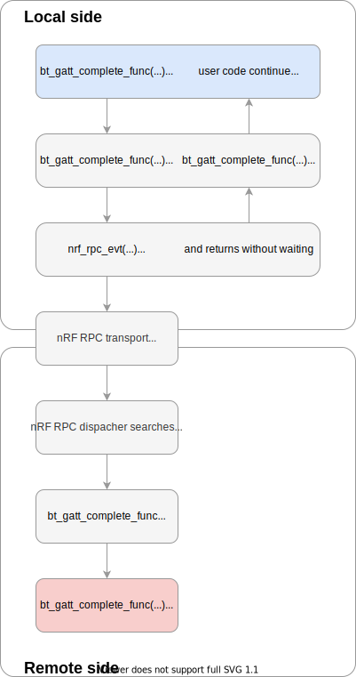

.. architecture:

Architecture
############

The following picture gives an overview of the nRF RPC architecture:

Types of communication
======================

Calls can be done in one of two ways: using a command/response or an event.

**Command and response** are intended to be used for a synchronous function calls.
The caller sends the command to the other side and waits for a response.
The response is sent after the remote function returns on the remote core.
The following image shows an example of the command and response flow.

**Events** are intended to be used for an asynchronous function calls.
The caller sends an event to the other side and returns immediately if there is free thread in thread pool (see :ref:`nrf_rpc_architecture_threads` section), otherwise it waits for available thread.
It is not possible to return anything from the remote side after receiving an Event, but it is possible to send an Event in opposite direction.
The following image shows an example of the event flow.

.. _nrf_rpc_architecture_threads:

Threads
=======

When a remote procedure call is received, it must be executed in context of a thread.
For this reason each side of the nRF RPC contains a thread pool.
It is OS-dependent and it is implemented in OS abstraction layer.
Number of threads in the thread pool is configurable.

When a caller wants to call a remote procedure, the nRF RPC checks if there is a thread available in a pool.
If there is not, then it waits until one becomes available, blocking the caller.
After that nRF RPC sends a packet and it is executed by available thread from a thread pool.
In the case of a Command being received, a Response is send directly to a waiting thread, so no new thread is allocated for a response.

Sample command/response diagrams are on the image below.

.. image:: img/cmd_simple.svg
   :alt: nRF RPC Simple Command flow
   :align: center

A thread waiting for a response may be reused to receive a new incoming command from the remote thread that the local thread is waiting for, e.g. when callback is called synchronously.
Below diagram shows that situation.

.. image:: img/cmd_recursive.svg
   :alt: nRF RPC Simple Command flow
   :align: center

Events always reserve a new thread from remote thread pool.
Special attention is required when sending multiple events one after another, because each event will reserve a new thread. Sending events too fast may consume entire thread pool and as the result block all the outgoing commands and events.
Sample events are shown on diagram below.

Error handling
==============

There are two kind of errors that can happen.

1. Error during parsing of incoming packet.
   This kind of error cannot be directly returned to the user e.g. as a return value.
   User is informed about such errors via a callback.
   First, if a group in which error happen is known then group error callback is called.
   Second, a global error handler (provided to :cpp:func:`nrf_rpc_init` function) is called.
   Malformed packet is something that should not normally happen, because transport layer is responsible for reliable packet transferring.
   Errors should be treated as a serious problems from which nRF RPC probably will not recover.

2. Error during packet sending.
   This kind of errors are passed to the caller as a return value.
   They indicate that the transport layer is not able to transfer this packet.
   They should be also treated as a serious problems from which nRF RPC probably will not recover, because missing packets may put nRF RPC in undefined state.

It is also possible to pass errors during packet sending to an error handler by using ``_no_err`` variant of sending functions.

Lower layers
============

Lower layers of nRF RPC are OS-dependent.
They are responsible for a communion with a transport medium, managing a thread pool, thread synchronization and communication and logging.

NOTE: It is not required to know how the lower layers is implemented when using the nRF RPC API.
Knowledge of its implementation is required to implement an alternate transport, or to port to a different operating system.

Transport
---------

Transport's main goal is to transfer packets between two sides.
The transport implementation can be selected by the configuration.

Currently the default transport is `OpenAMP <https://github.com/OpenAMP/open-amp/>`_ on `Zephyr <https://www.zephyrproject.org/>`_.

The template header describing the nRF RPC transport APIS is ``template/nrf_rpc_tr_tmpl.h``.
Header file ``include/rp_trans.h`` is responsible for including right transport header file based on the configuration.

Operating system abstraction
----------------------------

Operating system abstraction provides functionality for nRF RPC that depends on system.
It manages a thread pool, do thread synchronization and communication.

The template header describing OS abstraction is ``template/nrf_rpc_os_tmpl.h``.

Logging
-------

nRF RPC logs some activities that it do.
It allows simpler tracking, diagnosis and also debugging.
It provides four levels for logging: errors, warnings, information and debug.
Error logs indicate some serious error, so they should be enabled if possible.
Debug logs should be enabled only to track some problem.

The template header describing logger is ``template/nrf_rpc_log_tmpl.h``.
