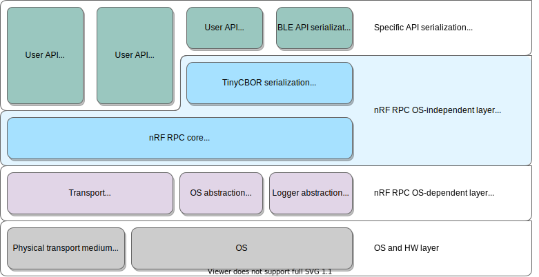

.. architecture:

Architecture
############

The following picture gives an overview of the nRF_RPC architecture:

Types of communication
======================

Calls can be done in one of two ways: using a command/response or an event.

**Command and response** are intended to be used for a synchronous function calls.
The caller sends the command to the other side and waits for a response.
The response is send after end of execution of the a remote function.
Following image shows an example of the command and response flow.

**Events** are intended to be used for an asynchronous function calls.
The caller sends an event to the other side and returns immediately if there is free thread in thread pool, otherwise it waits for available thread.
It is not possible to return anything from the remote side, but it is possible to send another event in opposite direction.
Following image shows an example of the event flow.

Threads
=======

When a remote procedure call arrived it must be executed in context of some thread.
For this reason each side of the nRF_PRC contains a thread pool.
It is OS-dependent, so it is handled by the transport layer.
Number of thread in the thread pool is configurable.

When a caller wants to call a remote procedure the nRF_RPC reserves a thread on the remote thread pool and sends a packet to it.
If there is no free thread in the pool then it waits until it will be available.
Response is send directly to a waiting thread, so no new thread is allocated for a response.

Sample command/response diagrams are on the image below.

Thread waiting for a response may be reused to receive a new incoming commands from the remote thread that local thread is waiting for, e.g. when callback is called synchronously. Below diagram show that situation.

.. image:: img/cmd_recursive.svg
   :alt: nRF_RPC Simple Command flow
   :align: center

Event always reserve a new thread from remote thread pool.
It is dangerous to send a lot of events one after another, because each event will reserves a new thread, so the thread pool may be consumed entirety.
Sample events are shown on below diagram.

Error handling
==============

In some cases error cannot be returned directly to the user e.g. as a return value.
One example of that situation is when a packet was received, but it is corrupted.
In this case user function :cpp:func:`nrf_rpc_error_handler` will be called.
It is weakly defined in nRF_RPC, so it can be overridden by the user definition.
Default weak implementation is empty, but the error is put to the log before calling :cpp:func:`nrf_rpc_error_handler`.

Second situation is when we want to serialize function that returns `void`.
We cannot return an error code in this case.
It is possible to use :cpp:func:`nrf_rpc_cmd_send_noerr` or :cpp:func:`nrf_rpc_cbor_cmd_send_noerr` which returns `void` and any error redirects to :cpp:func:`nrf_rpc_error_handler`.

:cpp:func:`nrf_rpc_report_error` can be used to pass errors to :cpp:func:`nrf_rpc_error_handler`.

:cpp:func:`nrf_rpc_error_handler` will also receive fatal errors that happen on the remote side and they may affect stability of the nRF_RPC connection.

Porting to OS
=============

The nRF_RPC needs a port for the operating system.
It has to provide:

* ``nrf_rpc_log.h`` for logging system abstraction according to the template ``template/nrf_rpc_log.h``.
* Transport layer according to the template ``template/rp_trans_tmpl.h``.
